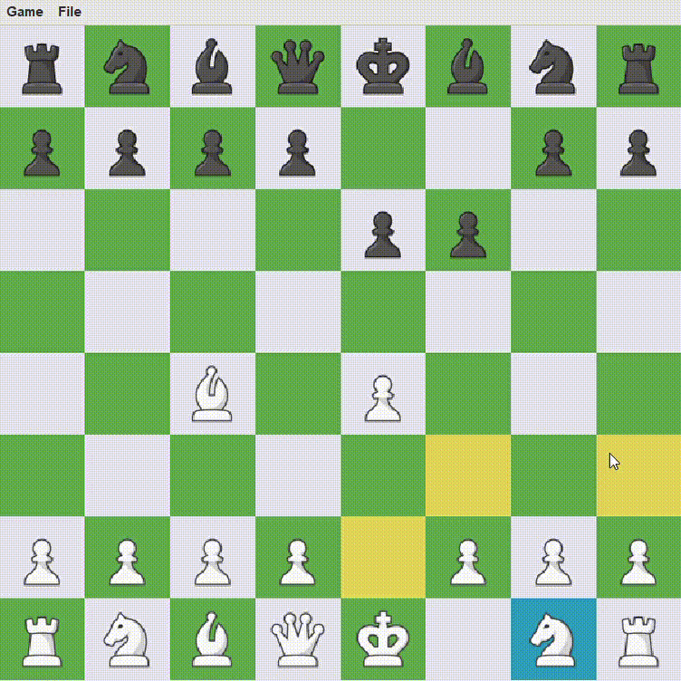
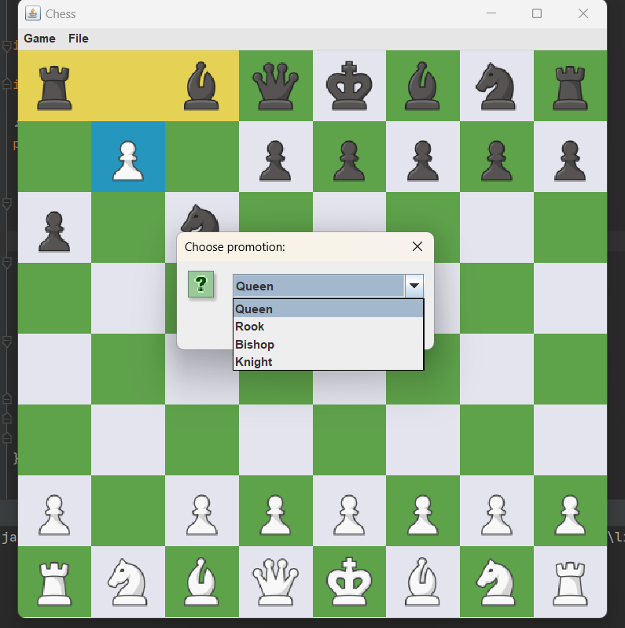
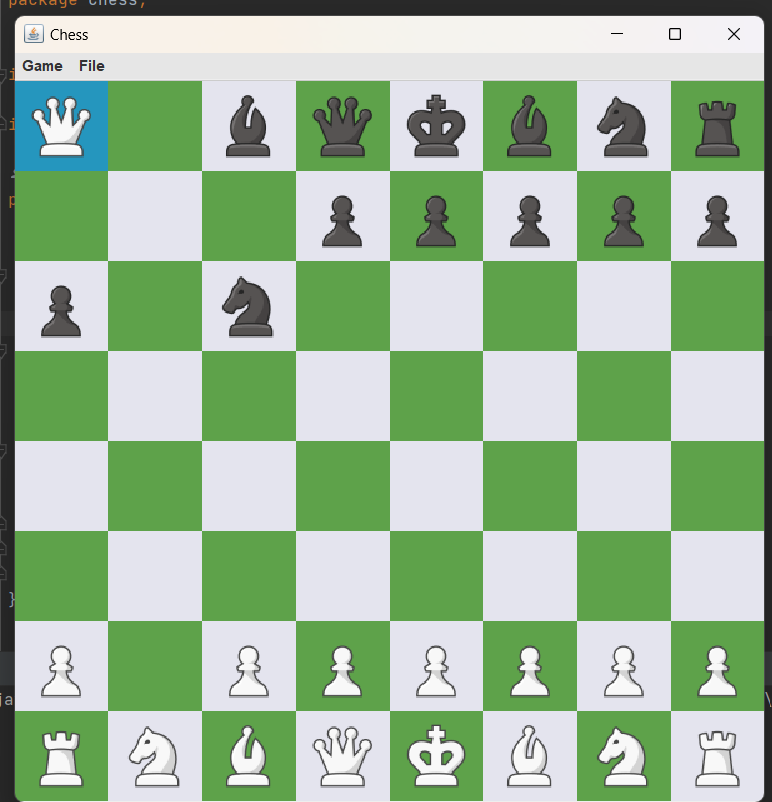

# Chess Game with Java
## Basic rules of the Game
1. The game is played on a board with 64 squares arranged in an 8x8 grid.
2. Each player starts with 16 pieces: one king, one queen, two rooks, two knights, two bishops, and eight pawns.
3. The goal of the game is to put the opponent's king in checkmate, which means that it is under attack and cannot escape capture on the next move.
4. White always goes first, and then turns alternate.
5. Each piece moves in a specific way:
- Pawns can only move forward one square at a time, except on their first move when they can move forward two squares. Pawns capture diagonally one square in front of them.
- Rooks move horizontally or vertically any number of squares.
- Knights move in an L-shape (two squares in one direction and then one square in a perpendicular direction).
- Bishops move diagonally any number of squares.
- The queen can move horizontally, vertically, or diagonally any number of squares.
- The king can move one square in any direction.
6. If a piece moves onto a square occupied by an opponent's piece, the opponent's piece is captured and removed from the board.
7. A player can put the opponent's king in check by attacking it with one of their pieces. The opponent must then move their king out of check on their next move, block the check with another piece, or capture the attacking piece.
8. The game can end in one of three ways: 
- checkmate (when one player's king is under attack and cannot escape capture)
- stalemate (when one player has no legal moves but their king is not in check)
- draw (when the players agree to a draw, there are not enough pieces left to checkmate, or a specific situation arises where the game must be declared a draw).

## Some special moves:
- Castling (when the king moves two squares towards a rook, and the rook moves to the square over which the king crossed)

- En passant (when a pawn captures an opponent's pawn that has just advanced two squares from its starting position)

- Promotion (when a pawn reaches the opponent's side of the board, it can be promoted to any other piece, except for a king).

  
   

